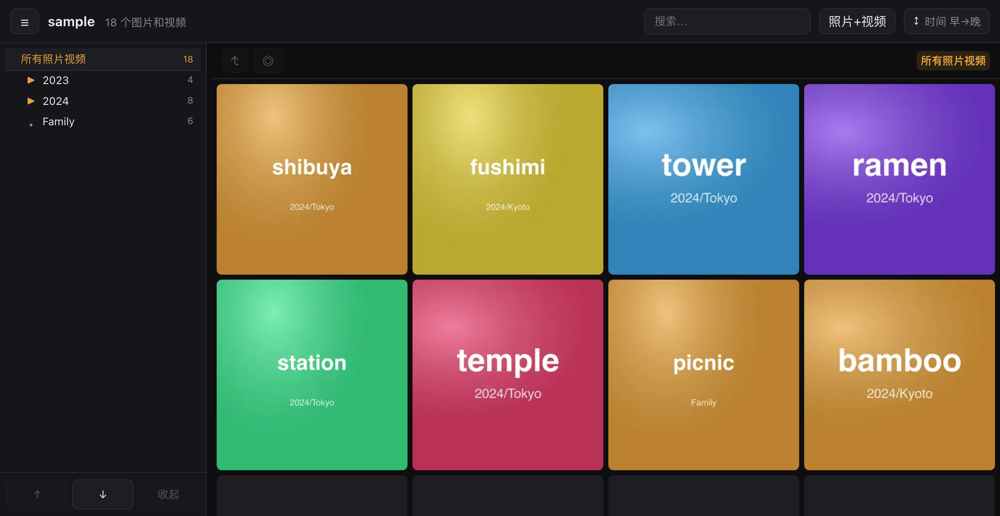
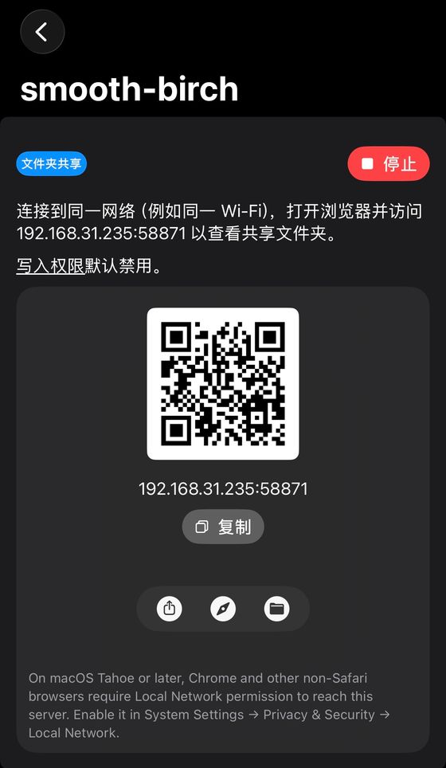

# Pocket Album

> 把一个装满照片/视频的 U 盘,变成**双击即开、离线、响应式**的网页相册。无需服务器、无需联网、不改动你的原始文件。
>
> *Turn a USB drive of photos & videos into a double-click, offline, responsive web gallery — no server, no internet, your originals untouched.*

插上 U 盘 → 双击里面的 `打开相册.html` → 在浏览器里像相册一样浏览。电脑上是大图瀑布 + 目录树,手机上是紧凑网格 + 滑动。



## 平台支持

| 平台 | 支持 |
|------|------|
| **电脑**(macOS / Windows / Linux) | ✅ 双击即用,体验最佳 |
| **安卓** | ✅ 文件管理器里打开即用 |
| **iPhone / iPad** | ✅ 用一个本地服务器 App 打开(见[下文](#在-iphone--ipad-上用本地服务器));无法用 `file://` 直接双击 |

## 功能

- 可折叠的目录树(手风琴式)、面包屑导航、目录中定位所选照片
- 响应式:电脑大图网格 + 键盘导航;手机紧凑网格 + 滑动
- 缩略图懒加载 + 分块渲染,几万张也流畅
- 全屏看图:← → / ↑ ↓ 切换、下滑关闭、原生视频播放、下载原图
- 按时间 / 文件名排序;按「照片 / 视频 / 全部」筛选;搜索文件名与目录名
- **HEIC(iPhone 照片)**:macOS 上用系统 `sips` 自动转出网页可看的 JPEG;下载时仍给原始 `.heic`
- **视频封面**:扫描时生成真实缩略图(优先 `ffmpeg`,macOS 上回退系统 `qlmanage`),离线、跨编码都能显示;两者都没有时再回退浏览器抓帧
- 入口页自动显示 U 盘卷名

## 支持的格式

- **图片**:jpg / png / gif / webp / bmp / avif / heic / tiff / dng(RAW)
  - heic / tiff / dng 浏览器不能直接显示,扫描时用 macOS `sips` 转出网页版 JPEG(下载仍是原始文件)
- **视频**:mp4 / mov / m4v / webm / mkv / avi …(能否播放取决于浏览器对该编码的支持)
  - 想要最稳的视频封面,建议装 `ffmpeg`(`brew install ffmpeg`);macOS 不装也行,会用系统 `qlmanage` 兜底

## 快速开始

需要一台装了 [Node.js](https://nodejs.org) 的电脑,**只在建索引时用一次**。

```bash
git clone git@github.com:superbaobao/pocket-album.git
cd pocket-album
npm install                                  # 仅首次,安装 sharp

node build-index.mjs /Volumes/你的U盘 --scan   # macOS,首次/加了新照片用 --scan
# Windows:  node build-index.mjs E:\ --scan
```

> **`--scan` vs 默认**:不带 `--scan` 时脚本只**更新相册程序**(很快,不动照片);带 `--scan` 才会**扫描照片、生成缩略图**。所以日常升级程序用默认即可,只有第一次或新增了照片才需要 `--scan`,避免误触发全量重扫。

完成后,U 盘根目录很干净:

```
U盘/
├── 打开相册.html        ← 电脑上双击这个观看
├── index.html          ← 内容相同;本地服务器(如 iOS)访问 "/" 时自动加载
├── _pocketalbum/        ← 程序与缩略图(app.js / app.css / media-index.js / thumbs / web)
├── 照片视频目录A/        ← 你的照片/视频,原样不动
└── 照片视频目录B/        ← 可以有多个,任意层级嵌套;脚本会扫描整棵目录树
```

加了新照片?**再跑一次 `--scan`** 即可——增量,只处理新文件。

### HEIC 占空间提示

每张 HEIC 会多生成一份网页版 JPEG(约 0.8–1.5MB)。U 盘空间紧张时降低分辨率:

```bash
node build-index.mjs /Volumes/你的U盘 --scan --web=1600   # web 版最长边 1600px(默认 2560)
```

## 本地试玩

```bash
npm run sample        # 生成 ./sample 测试图并建索引
open sample/打开相册.html
```

## 工作原理

浏览器出于安全限制不能直接读取本地文件夹,所以 `build-index.mjs` 会:扫描目录树 → 生成缩略图 → 把文件清单内联进 `media-index.js`(用 `<script>` 加载,绕开 `file://` 不能 `fetch` 的限制)→ 把相册程序拷到 U 盘。之后整套是**纯静态**的,离线运行,不上传任何数据。

## 在 iPhone / iPad 上用（本地服务器）

iOS 的 Safari 不能像电脑那样用 `file://` 双击打开 U 盘里的网页。办法是在设备上跑一个**本地 HTTP 服务器**——相册全是相对路径,只要通过 `http://` 提供就能原样运行,**无需联网、不依赖别的设备**。亲测用 [**PocketServer**](https://apps.apple.com/us/app/pocketserver-folder-sharing/id6743850070) 全程顺畅(含视频播放/拖进度),步骤如下:

1. **接盘**:把 U 盘(ExFAT,iOS「文件」可直接读)插到 iPhone / iPad 的 **USB-C 口**;在系统「文件」App 里能看到它,确认根目录有 `index.html`、`_pocketalbum/` 和你的照片目录。
2. **装 App**:从 App Store 安装 [PocketServer: Folder Sharing](https://apps.apple.com/us/app/pocketserver-folder-sharing/id6743850070)。
3. **建「文件夹共享」**:在 PocketServer 里新建一个**文件夹共享**,把目录指到 U 盘的**相册根目录**(就是含 `index.html` 的那一层),启动(右上角显示「停止」即在运行)。卡片上会给出一个**局域网地址 + 端口**(形如 `192.168.31.235:58871`,端口自动分配)、二维码和「复制」。默认**写入权限禁用(只读)**,不会误改 U 盘上的原始文件,正合相册用途。
4. **打开**:点卡片下方的**「在浏览器打开」**(指南针图标),或手输 / 扫码该地址 → 根目录的 `index.html` 自动加载,无需输入中文文件名。Safari 里点分享菜单**「添加到主屏幕」**,以后像 App 一样一点即开。
5. 视频点开即播、可拖进度;翻看、搜索、目录树都和电脑端一致。

<p align="center">
  
  <br><sub>PocketServer 启动后:点指南针图标(在浏览器打开),或手输 / 扫码地址</sub>
</p>

> - PocketServer 可后台常驻,服务器在切到别的 App 或锁屏后仍运行。它给的是局域网地址,所以**同一 WiFi 下其它设备**输入同一个 `http://局域网IP:端口` 也能一起看。
> - 在 **macOS Tahoe 及以上**用电脑看时,Chrome 等非 Safari 浏览器需在「系统设置 → 隐私与安全性 → 本地网络」里给浏览器授权才能访问。
> - **在 iOS 上保存原图/视频**:全屏的 **⬇** 会把原始文件(HEIC 也给原始 `.heic`)存进「文件」App 的「下载」,不直接进「照片」相册。想进相册:图片可**长按大图 → 存储到照片**;视频先 **⬇** 下载,再到「文件」里**分享 → 存储视频**。

**其它可选的本地服务器 App**(任选其一即可,选之前确认两点:能否把**服务目录指到外接 U 盘**、是否支持 **HTTP Range**——视频拖进度要用):

| App | 说明 |
|-----|------|
| [PocketServer: Folder Sharing](https://apps.apple.com/us/app/pocketserver-folder-sharing/id6743850070) | ✅ 本文亲测;可后台常驻,视频播放/拖进度正常 |
| [Server: Host Files Locally](https://apps.apple.com/us/app/server-host-files-locally/id1668447062) | 可后台运行,服务本机/iCloud 文件夹;外接盘支持需自测 |
| [Simple Server: HTTP Server](https://apps.apple.com/us/app/simple-server-http-server/id6443893597) | 轻量,服务文件夹到局域网;iPad 可分屏边开服务边看 |
| [TinyServer](https://apps.apple.com/us/app/tinyserver/id1517211662) | 有 Bonjour 友好域名,但**不能后台**、未提 Range,视频体验可能差 |

## 操作说明

随时按 **空格** 在「浏览 ↔ 全屏」之间来回切换。

### ⌨️ 键盘

**浏览照片(网格)**

| 按键 | 作用 |
|------|------|
| `↑` `↓` `←` `→` | 在照片间移动选中(左右一张,上下一行) |
| `空格` / `回车` | 打开全屏 |
| `/` | 跳到搜索框 |

**全屏看图**

| 按键 | 作用 |
|------|------|
| `←` `↑` | 上一张 |
| `→` `↓` | 下一张 |
| `空格` | 退回浏览 |
| `Esc` | 关闭 |

**目录树**(先点一下目录树,让焦点在它上面)

| 按键 | 作用 |
|------|------|
| `↑` `↓` | 在可见目录间上下移动 |
| `←` | 收起当前目录 |
| `→` | 展开当前目录 |
| `回车` | 打开该目录第一张照片 |

### 🖱️ 鼠标

**目录树**
- **单击目录**:展开它(并收起其它分支)+ 显示该目录的照片;**再点同一个 = 收起**(toggle)
- 点最上面的「所有照片视频」:看全部

**网格(电脑)**
- **单击**照片:选中(橙色框)
- **双击**照片:全屏

**画廊左上角**
- **↰ 上一层**:回到父目录(当前选中的照片**保持在同一行不跳**)
- **◎ 定位**:把目录树展开并高亮到当前选中照片所在的子目录

**全屏**
- `‹` `›`:上一张 / 下一张
- **⬇**:下载原图(若原图是 HEIC,下载原始 `.heic`)
- **✕** 或点图片外的暗色区域:关闭

**目录栏底部按钮**:`↑` `↓` 上下移动 ·「展开/收起」切换当前目录

### 📱 触屏(手机 / 平板)
- **点照片**:直接全屏
- 全屏**左右滑**:换上一张 / 下一张;**下滑**:关闭
- 左上角 **☰**:打开 / 收起目录

### 📐 响应式 & 目录栏
- **电脑**:目录栏常驻左侧 + 大图网格;**手机 / 窄屏(≤760px)**:目录栏变抽屉(点 **☰** 唤出),网格更紧凑。缩放窗口跨过断点会**自动切换**。
- **拖动目录栏右边缘**(光标变 `↔`)调整宽度(160–600px),会**记住**下次的宽度。
- 点左上角 **☰** 可整体收起 / 展开目录栏。

### 🔝 顶栏
- **搜索框**:同时搜**文件名和目录名**
- **类型**按钮:照片+视频 / 照片 / 视频
- **排序**按钮:时间 早→晚 / 时间 晚→早 / 文件名

## 致谢

为整理家人的照片而做。Built with [sharp](https://sharp.pixelplumbing.com/).

## License

[MIT](LICENSE)
